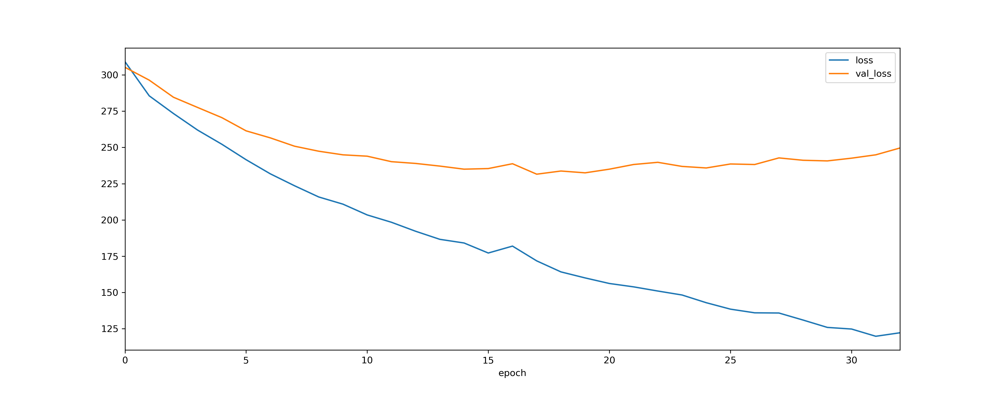
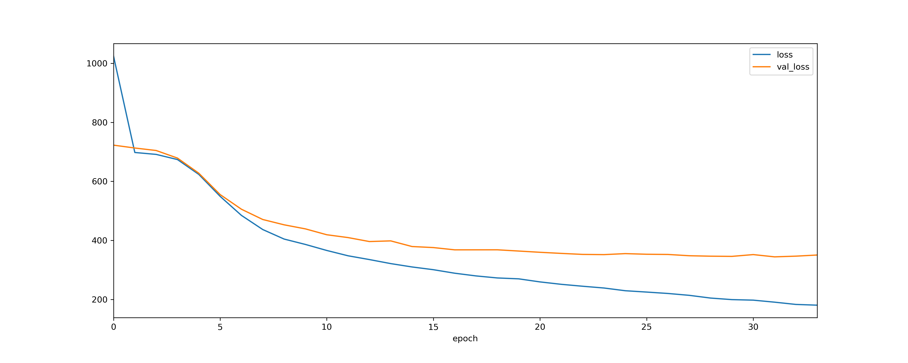

Model log
=========

Version 0.1.0c
``````````````

February 25, 2020

Version 0.1.0b
``````````````
February 25, 2020

.. list-table::
    :widths: 50 100

    * - 
      - **Value**
    * - **Frame Length**
      - 1500 - 3000 frames
    * - **Transcription Length**
      - 150 - 300 characters
    * - **Total Samples**
      - 3745
    * - **Train : Val : Test**
      - 60 : 40 : 0
    * - **Batch Size**
      - 16
    * - **Model**
      - BaselineASRModel with default params
    * - **Vocab Len**
      - 29 {a-z., }
    
**Evaluation**



.. list-table::
    :widths: 100 100 100 100

    * - **Dataset**
      - **Loss**
      - **WER**
      - **# Samples**
    * - **train**
      - 362.8634
      - 103.754
      - 2247
    * - **test**
      - 415.5348
      - 102.7734
      - 1498

Version 0.1.0a
``````````````
February 25, 2020

.. list-table::
    :widths: 50 100

    * - 
      - **Value**
    * - **Frame Length**
      - 2000 - 3000 frames
    * - **Transcription Length**
      - 200 - 300 characters
    * - **Total Samples**
      - 1000
    * - **Train : Val : Test**
      - 60 : 40 : 0
    * - **Batch Size**
      - 16
    * - **Model**
      - BaselineASRModel with default params
    * - **Vocab Len**
      - 29 {a-z., }
    
**Evaluation**



.. list-table::
    :widths: 100 100 100 100

    * - **Dataset**
      - **Loss**
      - **WER**
      - **# Samples**
    * - **train**
      - 179.7891
      - 98.4834
      - 600
    * - **test**
      - 179.7891
      - 98.4834
      - 600

